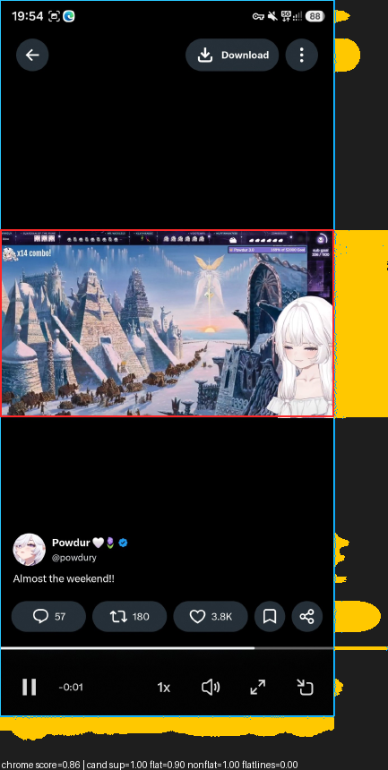

# autocrop

[](https://crates.io/crates/autocrop)
[](https://pypi.org/project/autocrop-rs/)
[](https://github.com/Nachtalb/autocrop-rs/actions/workflows/ci.yml)

Finds the actual content inside a screenshot and crops away letterbox bars, app chrome and meme text, while leaving photos, art and manga pages untouched.

## Example

A phone screenshot of a tweet with an embedded stream clip (1194 x 2560), the
crop `autocrop` writes (1194 x 670), and a debug overlay showing the row and
column profiles the detector works from together with the chosen box.

| input | crop | debug overlay |
|---|---|---|
|  |  |  |

```
$ autocrop docs/example.jpg --out out --time
example.jpg: chrome score=0.86 box=Some((0, 822, 1194, 1492))
  decode 16.6 ms, detect 11.0 ms (1194x2560)
```

## Usage

### Install

- Prebuilt binaries for Linux, macOS and Windows are attached to every
  [GitHub release](https://github.com/Nachtalb/autocrop-rs/releases);
  `cargo binstall autocrop` fetches the right one for your machine.
- From source: `cargo install autocrop`.
- Python: `pip install autocrop-rs` (or `uv add autocrop-rs`). The wheel also
  carries the command line, so `uvx autocrop-rs screenshot.jpg` runs it
  without installing anything.

### Command line

```
autocrop <files or folders>... [--out DIR] [--all] [--time]
```

Writes each cropped image under `--out` (default `out/crops`) with its
original name, so do not point `--out` at the input folder. One line per file
tells you the decision, its score and the box; `--all` also copies images that
were not cropped, `--time` adds decode and detect times.

### Rust

```rust
use autocrop::{Params, crop_image, find_crop};

let (image, result) = crop_image("screenshot.jpg", &Params::default())?;
let result = find_crop(&rgb_image, &Params::default()); // CropResult { rect, score, reason }
```

`result.rect` is the crop in original pixel coordinates or `None`;
`result.reason` names the stage that decided (`letterbox`, `chrome`,
`no-crop`, `no-crop:grayscale-light`, ...).

### Python

```python
import autocrop_rs

result = autocrop_rs.detect_file("screenshot.jpg")
if result:                       # truthy when a crop was found
    x0, y0, x1, y1 = result.box

result, png = autocrop_rs.crop_bytes(data)                       # bytes in, PNG bytes out
result, jpg = autocrop_rs.crop_bytes(data, format="jpeg", quality=85)
autocrop_rs.crop_bytes_to_file(data, "out/screenshot.webp")     # format by extension
autocrop_rs.detect_array(numpy_hxwx3_uint8)                      # already decoded pixels
```

All calls release the GIL. Every detector threshold is available as a keyword
on `autocrop_rs.Params`. See [python/README.md](python/README.md) for the
full API.

## How it works

All work happens on a copy downscaled to at most 800 px on the long side;
the box is mapped back to original coordinates at the end.

1. **Background colour** (`profiles::estimate_background`). Dominant colours
   of the outer band are candidates; the one that fills the most complete
   rows and columns wins. This is robust against a one pixel outline or a
   status bar in a different shade, and against large dark photos, whose
   dark tones never fill whole rows.
2. **Profiles** (`profiles::compute_profiles`). Per pixel: distance to the
   background colour (clipped and normalised), "is background" within a
   tolerance, a stricter "is background" with a tight tolerance, and
   adjacent-row / adjacent-column edges. From those: per row and per column
   non-background fractions, longest contiguous edge runs, and 2-D prefix
   sums so any rectangle statistic is O(1).
3. **Flat bar trimming** (`letterbox::trim_flat_bars`). From each image side
   whose outer band is a single colour, walk inward while rows or columns
   are entirely that colour. The trim is kept only when the walk stops at a
   real content edge (a mostly non-background line or a long straight edge),
   so a soft glow fading into black is not trimmed. Grayscale images with
   light margins (manga pages) are never trimmed.
4. **Chrome removal** (`chrome::find_content_rect`) inside the trimmed
   region. Boundary candidates are rows and columns with a long straight
   edge or a jump in mean background distance. Every combination of two
   horizontal and two vertical candidates is scored with:
   - *side support*: for each side, the larger of the edge fraction along
     it and the background-distance contrast between a strip just inside
     and just outside (sides on the region border count as fully supported);
   - *outside flatness*: fraction of pixels outside the rectangle that are
     background, plus a strict-tolerance version that separates real chrome
     from dark painted areas (waived when every side is strongly supported);
   - *inside non-flatness*: fraction of pixels inside that are not
     background, which rejects text-on-a-page interiors;
   - *flat lines inside*: rows and columns inside that are mostly
     background, which penalises rectangles that swallow chrome;
   - horizontal centring (or spanning the full width) as a hard constraint;
   - area, as a small bonus so the outer game viewport beats an inner
     dialog box.
   The best valid rectangle is accepted above a score threshold.
5. **Guards**. A crop must remove at least 1 percent of the area. Grayscale
   images whose outside region is light are never cropped (manga pages).
   A bar-trim result whose interior is mostly background is discarded.

Every threshold lives in `autocrop::Params` with a doc comment. The whole
pipeline is plain integer and float arithmetic over a few masks and prefix
sums; there is no Canny, no Hough and no machine learning.

## Results

Labelled sample set of 20 screenshots with manual crops and 12
non-screenshots, release build:

| metric | value |
|---|---|
| positives with IoU >= 0.85 | 20 / 20 |
| mean IoU on positives | 0.979 |
| false crops on negatives | 0 / 12 |
| detector time per image (800 px working copy) | ~9.5 ms |

The detector is not the bottleneck: on the example above decoding the
progressive JPEG takes 16.6 ms against 11 ms for detection. Building with
`-C target-cpu=native` was measured and changes nothing, so the portable
build is what ships.

## Limitations

- A caption box or text line that touches the content with no background
  gap between them is treated as part of the content.
- Content whose edge colour equals the chrome colour along an entire side
  (a black video bottom on a black background) relies on the other sides
  and on the mean-distance jump; very dark content next to black gives low
  support and can be rejected.
- Grayscale content on a light background is never cropped by design, which
  also skips black-and-white photo memes on white.
- Only one rectangle is returned; collages and stacked frames are left as
  they are.

## Building

```
cargo build --release
```

The release profile uses fat LTO, a single codegen unit, `panic = "abort"`
and symbol stripping. The stripped `autocrop` binary is about 1.2 MB and
links only `image` (JPEG, PNG, WebP, GIF, BMP decoders), `lexopt` and
`serde_json`. Development notes, layout and the release process are in
[CLAUDE.md](CLAUDE.md) and [RELEASING.md](RELEASING.md).

## License

MIT, see [LICENSE](LICENSE).
